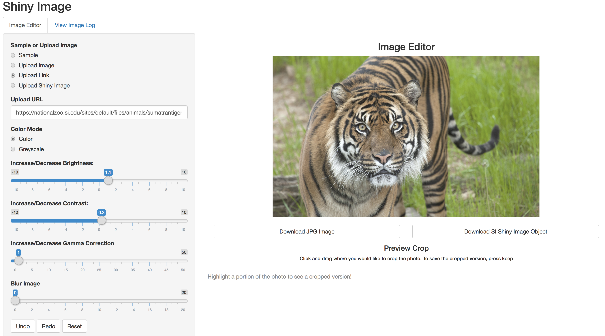

Imaging package, with an emphasis on journaling, i.e. recording history of changes. Undo/redo operations, ability to display multiple versions (currently under construction), etc. The history is persistent, i.e. across sessions. Can be run from the R command line, or from a Shiny-based GUI.

## Functions

Once installed, a user can create a shinyimg object to modify pictures.

#### Creating a new image

```R
> tiger <- shinyimg$new('https://upload.wikimedia.org/wikipedia/commons/1/1c/Tigerwater_edit2.jpg')
# In addition to a web link, a user can also upload a jpeg, png, or tiff saved locally.
# We will continue tiger as our shiny image object to modify for the rest of our examples
```

#### Autodisplay
```R
# A user can render an image after every modification or they can turn on autodisplay
> tiger$render() #user needs to initially render image
# a window should pop up with an image of the tiger
> tiger$set_autodisplay() #the user no longer needs to render image after a modification

# To turn off autodisplay
> tiger$set_autodsiplay_OFF()
# user must now render an image to view modifications
```

#### Brightness

```R
# There are three ways to modify brightness
# The initial value of brightness is 0
> tiger$add_brightness() #adds brightness by 0.1
> tiger$remomve_brightness() #removes brightness by 0.1
> tiger$set_brightness(1) #sets brightness by number inputted

```

#### Contrast
```R
# There are three ways to modify contrast
# The initial value of contrast is 0
> tiger$add_contrast() #adds contrast by 0.1
> tiger$remomve_contrast() #removes contrast by 0.1
> tiger$set_contrast(2) #sets contrast by number inputted
```

#### Gamma Correction
```R
# There are three ways to modify gamma correction
# The initial value of gamma correction is 1
> tiger$add_gamma() #adds gamma correction by 0.5
> tiger$remove_gamma() #removes gamma correction by 0.5
> tiger$set_gamma(2) #sets gamma correction by number inputted
```

#### Blurring
```R
# There are three ways to blur an image
# The initial value of blur is 0
> tiger$add_blur() #adds blurring by 1
> tiger$remove_blur() #removes blurring by 1
> tiger$set_blur(2) #sets blurring by number inputted
```

#### Rotation
```R
# There are three ways to rotate an image
# The initial value of rotate is 0
> tiger$add_rotate() #rotates image by 1 degree to the right
> tiger$remove_rotate() #rotates image by 1 degree to the left
> tiger$set_rotate(2) #sets rotation by degree inputted
```

#### Colormode
```R
# A user can change an image to grayscale or back to colormode
> tiger$set_grayscale(1) #changes image to grayscale
> tiger$set_grayscale(0) #reverts image to color
```

#### Crop
```R
# There are two ways a user can crop an image
> tiger$crop() #must have image rendered before this action is called
# A + icon will appear on the window that contains the image for user to select the crop

# A user can specify the coordinates
tiger$cropxy(0,10,0,10) 
# The fields of cropxy are: min of x, max of x, min of y, max of y
# must be less than the dimensions of image

# to get dimensions of the image
> tiger$size()
```

#### Undo
```R
# A user can undo a modification
> tiger$undo()
```

#### Redo
```R
# A user can redo a modification
> tiger$redo()
```

#### Get Settings
```R
# A user can view the settings of the image using get
> gethistory() #returns recorded changes to image
> get_brightness() #returns brightness value
> get_contrast() #returns contrast value
> get_gamma() #returns gamma correction value
> get_blur() #returns blur value
> get_rotate() #returns degrees rotated
> get_color() #returns color mode value
```

#### Save
```R
# A user can save the SI object to save object with history changes of image
# A user can re-edit an SI object
> tiger$save() #saved in current directory as workspace.si
# A user can also specify the file name
> tiger$save('save.si') 

# A user can also save the physical image e.g. the jpg image
> tiger$savejpg()
```

#### Load
```R
# A user can reupload a previously saved SI object
> tiger$load('workspace.si')
```

## Using the Shiny GUI


#### Starting the Shiny GUI
```R
> runShiny()
```

#### Uploading an Image
A user can use the sample, upload an image, upload a link, or upload an SI object

#### Modifying the Image
A user can change the color mode (Color or Gray Scale), brightness, contrast, gamma correction, and blur. 

A user can also crop the image by clicking the image and dragging their preferred crop. A preview will pop up below. If a user likes the crop, they can click the `keep` button. Otherwise, the user can keep dragging the blue box that represents their crop to find the exact cropping they prefer. 

A user can also click `Undo`, `Redo`, or `Reset`. 

#### Saving an Image
A user can either click `Download the JPG Image` or `Download the SI Shiny Image Object`

#### Viewing the Image Log
A user can click the `View Image Log` tab. If they are modifying an image, the image log will automatically show the current image's action. Otherwise, a user can upload their own .si file to view actions logged. 

#### Exiting Shiny 
On the top right, click `Return to command line`